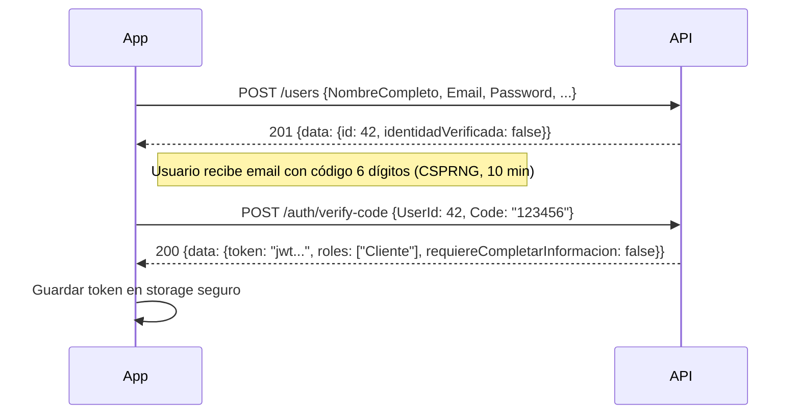
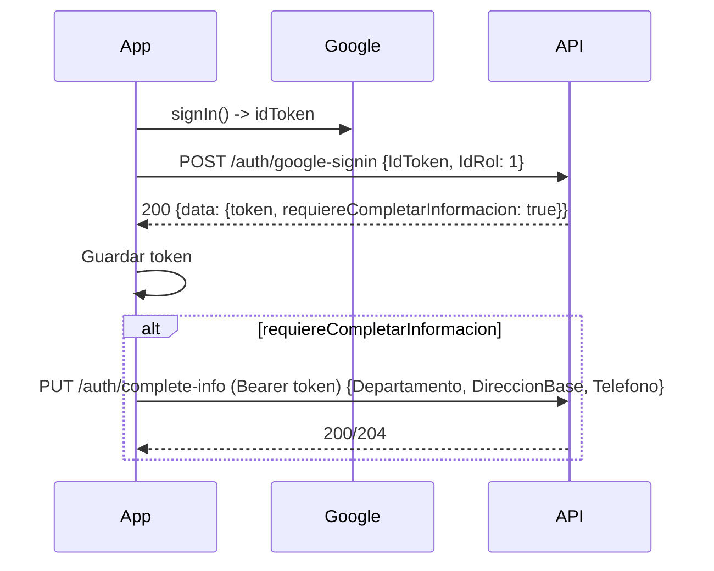
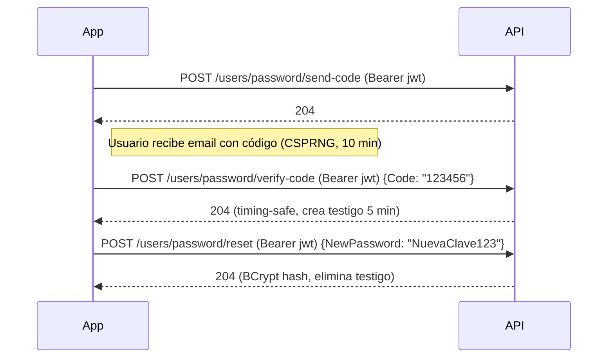

# Guía de Conexión API: OAuth, Autenticación y Contraseñas (Cliente Flutter)

> **Alcance**: Endpoints **exclusivamente** para los flujos documentados:
> - Google Sign-In
> - Login tradicional email/contraseña
> - Registro + verificación OTP
> - Completar perfil OAuth
> - Cambio de contraseña por OTP (usuario autenticado)
>
> **Base URL**: `<BASE_URL>/api` (reemplazar `<BASE_URL>` por el host real, ej. `https://api.agrotrade.com`)

---

## 1. Convenciones

| Convención | Detalle |
|------------|---------|
| **Autenticación** | Endpoints protegidos: header `Authorization: Bearer <JWT_AGROTRADE>` (JWT emitido por AgroTrade, **nunca** el `idToken` de Google). |
| **Content-Type** | `application/json` (request y response). |
| **Serialización JSON** | **PascalCase** (configuración por defecto de ASP.NET Core `System.Text.Json`). Los DTOs usan propiedades PascalCase (`UserName`, `IdToken`, `NewPassword`, etc.). |
| **Códigos HTTP** | `200 OK`, `201 Created`, `204 No Content`, `400 Bad Request`, `401 Unauthorized`, `403 Forbidden`, `404 Not Found`, `500 Internal Server Error`. |
| **Formato errores** | Envelope: `{ "ErrorMessage": "descripción" }` o `{ "mensaje": "..." }` según middleware. Ver tabla de errores por endpoint. |
| **Fechas** | ISO 8601 UTC (`yyyy-MM-ddTHH:mm:ss.fffZ`). |
| **Ids** | Enteros (`int`) para `UserId`, `IdRol`, etc. |

---

## 2. Tabla de Endpoints y Secuencias

| # | Flujo | Endpoint | Método | Auth | Descripción |
|---|-------|----------|--------|------|-------------|
| 1 | **Registro tradicional** | `/users` | POST | ❌ | Crea usuario, envía OTP email (CSPRNG, 10 min), devuelve `UserDto` (sin token). |
| 2 | **Verificar OTP registro** | `/auth/verify-code` | POST | ❌ | Valida código (consumo atómico), marca `IdentidadVerificada=true`, **devuelve JWT**. |
| 3 | **Login tradicional** | `/auth/login` | POST | ❌ | Email + password → **devuelve JWT** (BCrypt verify). |
| 4 | **Google Sign-In** | `/auth/google-signin` | POST | ❌ | `idToken` de Google → valida firma/audiencia → crea/encuentra usuario → **devuelve JWT** (+ flag `RequiereCompletarInformacion`). |
| 5 | **Completar perfil OAuth** | `/auth/complete-info` | PUT | ✅ Bearer | Rellena `Departamento`, `DireccionBase`, `Telefono` (requerido si `RequiereCompletarInformacion=true`). |
| 6 | **Enviar código cambio pwd** | `/users/password/send-code` | POST | ✅ Bearer | Genera OTP 6 dígitos (CSPRNG), lo guarda 10 min, envía email. |
| 7 | **Verificar código cambio pwd** | `/users/password/verify-code` | POST | ✅ Bearer | Valida OTP (timing-safe `FixedTimeEquals`), crea testigo `PWD_ALLOWED` 5 min. |
| 8 | **Restablecer contraseña** | `/users/password/reset` | POST | ✅ Bearer | Requiere testigo válido + `NewPassword` (min 8) → hashea BCrypt → elimina testigo. |

> **Orden obligatorio en cambio de contraseña**: 6 → 7 → 8 (sin saltar pasos). El `UserId` **siempre** sale del JWT (claim `sub`), **nunca** se envía en body.

---

## 3. Detalle por Endpoint

### 3.1 POST `/users` — Registro Tradicional

**Auth**: ❌ Pública (`[AllowAnonymous]`)

**Request Body** (`CreateUserDto`):

```json
{
  "NombreCompleto": "Juan Pérez López",
  "Email": "juan.perez@example.com",
  "Password": "secreto123",
  "Telefono": "81234567",
  "DireccionBase": "Barrio San Juan, 2c al sur",
  "Departamento": "Managua",
  "IdRol": 1
}
```

| Campo | Reglas (DataAnnotations) |
|-------|--------------------------|
| `NombreCompleto` | `required`, `minLength: 15` |
| `Email` | `required`, `EmailAddress` |
| `Password` | `required`, `minLength: 6` (cambio de pwd exige 8) |
| `Telefono` | `optional`, `^[578]\\d{7}$` (8 dígitos, inicia 5/7/8) |
| `DireccionBase` | `optional`, `maxLength: 200` |
| `Departamento` | `optional`, `maxLength: 30` |
| `IdRol` | `optional`, `default: 1` (Cliente), **no permitir 4 (Admin)** |

**Success Response** `201 Created`:

```json
{
  "isSuccess": true,
  "statusCode": 201,
  "message": "Usuario Registrado. Se envió un código de verificación a tu correo.",
  "data": {
    "id": 42,
    "name": "Juan Pérez López",
    "email": "juan.perez@example.com",
    "identidadVerificada": false,
    "telefono": "81234567",
    "direccionBase": "Barrio San Juan, 2c al sur",
    "fechaRegistro": "2026-01-15T14:30:00Z"
  }
}
```

**Errores frecuentes**:

| HTTP | Causa | Cuerpo ejemplo |
|------|-------|----------------|
| 400 | Email ya en uso | `{ "ErrorMessage": "Este Email ya esta en uso" }` |
| 400 | Validación DTO falla | `{ "ErrorMessage": "El nombre es obligatorio" }` |
| 403 | Intento crear `IdRol=4` | `{ "ErrorMessage": "NO PUEDES CREAR UNA CUENTA CON ESTE ROL" }` |
| 500 | Fallo BD / email | `{ "ErrorMessage": "Algo fallo al crear el usuario..." }` |

> **Nota**: El registro **no devuelve JWT**. El cliente debe llamar a `POST /auth/verify-code` con el código recibido por email. El código se genera con **CSPRNG** (`RandomNumberGenerator`) y expira en **10 minutos**.

---

### 3.2 POST `/auth/verify-code` — Verificar OTP Registro

**Auth**: ❌ Pública

**Request Body** (`VerifyCodeDto`):

```json
{
  "UserId": 42,
  "Code": "123456"
}
```

**Success Response** `200 OK` (`LoginResponse`):

```json
{
  "isSuccess": true,
  "statusCode": 200,
  "message": "Identidad verificada correctamente.",
  "data": {
    "userName": "Juan Pérez López",
    "token": "eyJhbGciOiJIUzI1NiIsInR5cCI6IkpXVCJ9...",
    "roles": ["Cliente"],
    "requiereCompletarInformacion": false
  }
}
```

**Errores**:

| HTTP | Causa |
|------|-------|
| 400 | Código incorrecto o expirado (`"El código es incorrecto o ha expirado."`) |
| 404 | Usuario no encontrado |
| 400 | Body inválido (falta `UserId` o `Code`) |

> **Guarda** `data.token` → úsalo como `Authorization: Bearer <token>` en siguientes requests. La validación consume el código atómicamente (un solo uso).

---

### 3.3 POST `/auth/login` — Login Tradicional

**Auth**: ❌ Pública

**Request Body** (`LoginDto`):

```json
{
  "Email": "juan.perez@example.com",
  "Password": "secreto123"
}
```

**Success Response** `200 OK` (`LoginResponse`):

```json
{
  "isSuccess": true,
  "statusCode": 200,
  "message": "Inicio de sesión exitoso.",
  "data": {
    "userName": "Juan Pérez López",
    "token": "eyJhbGciOiJIUzI1NiIsInR5cCI6IkpXVCJ9...",
    "roles": ["Cliente"],
    "requiereCompletarInformacion": false
  }
}
```

**Errores**:

| HTTP | Causa |
|------|-------|
| 401 | Email no existe o password incorrecto (`"Contraseña o Usuario incorrectos."`) |
| 400 | Body inválido |

> Verificación con **BCrypt** (work factor 11). JWT firmado HMAC SHA256, expiración 1 día, claims: `sub`, `email`, `name`, `jti`, `roles[]`.

---

### 3.4 POST `/auth/google-signin` — Google Sign-In

**Auth**: ❌ Pública

**Request Body** (`OAuthSignInDto`):

```json
{
  "IdToken": "eyJhbGciOiJSUzI1NiIsImtpZCI6Ij... (idToken de Google)",
  "IdRol": 1
}
```

| Campo | Nota |
|-------|------|
| `IdToken` | **Requerido**. Token `id_token` devuelto por Google Identity Services (no `access_token`). |
| `IdRol` | Opcional. Si no se envía, default `1` (Cliente). **No enviar `4` (Admin)**. |

**Success Response** `200 OK` (`LoginResponse`):

```json
{
  "isSuccess": true,
  "statusCode": 200,
  "message": "Usuario Registrado Con Google Exitosamente",
  "data": {
    "userName": "Juan Pérez",
    "token": "eyJhbGciOiJIUzI1NiIsInR5cCI6IkpXVCJ9...",
    "roles": ["Cliente"],
    "requiereCompletarInformacion": true
  }
}
```

**Campo clave**: `requiereCompletarInformacion = true` si el usuario OAuth falta `Departamento` OR `DireccionBase` OR `Telefono`.

**Errores**:

| HTTP | Causa |
|------|-------|
| 403 | `idToken` inválido / audience mismatch (`"Invalid Google token."`) |
| 400 | Body inválido |

> **Próximo paso si `requiereCompletarInformacion=true`**: Llamar `PUT /auth/complete-info` con el JWT recién obtenido. El `idToken` de Google **nunca** se usa como Bearer.

---

### 3.5 PUT `/auth/complete-info` — Completar Perfil OAuth

**Auth**: ✅ **Bearer JWT requerido** (`[Authorize]`)

**Headers**:
```
Authorization: Bearer <JWT_AGROTRADE>
Content-Type: application/json
```

**Request Body** (`GoogleCatchDataDto`):

```json
{
  "Departamento": "Managua",
  "DireccionBase": "Barrio San Juan, 2c al sur",
  "Telefono": "81234567"
}
```

| Campo | Validación |
|-------|------------|
| `Departamento` | `required`, `maxLength: 100`. Debe contener nombre válido de Nicaragua (ej. "Managua", "León", "Estelí", "RACN", "RACS", "Río San Juan", etc.). Se normaliza internamente. |
| `DireccionBase` | `required`, `maxLength: 500`. |
| `Telefono` | `required`, `maxLength: 8`, `[Phone]`, patrón `^[578]\\d{7}$`. |

**Success Response** `200 OK` (o `204 No Content`):

```json
{
  "isSuccess": true,
  "statusCode": 200,
  "message": "Datos Completados exitosamente",
  "data": null
}
```

**Errores**:

| HTTP | Causa |
|------|-------|
| 401 | JWT inválido / expirado / ausente |
| 401 | Usuario no existe o no es OAuth Google (`"Usuario no existe o No esta registrado con google"`) |
| 400 | Departamento inválido (`"Ingrese un Departamento Valido en nicaragua"`) |
| 400 | Validación DTO (campos requeridos, formato teléfono) |

---

### 3.6 POST `/users/password/send-code` — Enviar OTP Cambio Contraseña

**Auth**: ✅ **Bearer JWT requerido**

**Headers**:
```
Authorization: Bearer <JWT_AGROTRADE>
```

**Request Body**: **Vacío** (no se envía body).

**Success Response** `204 No Content` (sin cuerpo).

**Errores**:

| HTTP | Causa |
|------|-------|
| 401 | JWT inválido / `sub` claim ausente |
| 404 | Usuario no encontrado o sin email (`"No se encontró un correo asociado a esta cuenta."`) |
| 500 | Fallo envío email (SMTP) |

**Seguridad**: Genera código 6 dígitos con **CSPRNG** (`RandomNumberGenerator`), guarda en `IMemoryCache` clave `PWD_CODE_{userId}` TTL 10 min, envía email por canal fuera de banda.

---

### 3.7 POST `/users/password/verify-code` — Verificar OTP Cambio Contraseña

**Auth**: ✅ **Bearer JWT requerido**

**Headers**:
```
Authorization: Bearer <JWT_AGROTRADE>
Content-Type: application/json
```

**Request Body** (`VerifyChangePasswordOtpDto`):

```json
{
  "Code": "123456"
}
```

**Success Response** `204 No Content`.

**Errores**:

| HTTP | Causa |
|------|-------|
| 401 | JWT inválido |
| 400 | Código inválido, expirado, o longitud ≠ 6 (`"El código de verificación no es válido o expiró."`) |

**Seguridad**: Comparación **timing-safe** con `CryptographicOperations.FixedTimeEquals`. Consume el código y crea testigo `PWD_ALLOWED_{userId}=true` TTL 5 min.

---

### 3.8 POST `/users/password/reset` — Restablecer Contraseña

**Auth**: ✅ **Bearer JWT requerido**

**Headers**:
```
Authorization: Bearer <JWT_AGROTRADE>
Content-Type: application/json
```

**Request Body** (`ResetPasswordAfterOtpDto`):

```json
{
  "NewPassword": "NuevaClaveSegura123"
}
```

| Regla | Detalle |
|-------|---------|
| `NewPassword` | `required`, `minLength: 8` (validado en handler). |

**Success Response** `204 No Content`.

**Errores**:

| HTTP | Causa |
|------|-------|
| 401 | JWT inválido |
| 403 | Testigo `PWD_ALLOWED` no existe o expiró (`"Debes verificar el código antes de cambiar la contraseña."`) |
| 400 | `NewPassword` vacío o `< 8 chars` (`"La contraseña debe tener al menos 8 caracteres."`) |
| 404 | Usuario no encontrado (raro, ya autenticado) |

**Seguridad**: Verifica testigo (gate obligatorio), hashea con **BCrypt** (work factor 11), persiste, elimina testigo (un solo uso).

---

## 4. Flujos Completos Paso a Paso (Cliente Flutter)

### 4.1 Registro Tradicional + Verificación



**Pseudocódigo Flutter**:

```dart
// 1. Registro
final registerResp = await dio.post('$baseUrl/users', data: {
  'NombreCompleto': nameCtrl.text,
  'Email': emailCtrl.text,
  'Password': passCtrl.text,
  'Telefono': phoneCtrl.text,
  'DireccionBase': addrCtrl.text,
  'Departamento': deptCtrl.text,
  'IdRol': 1,
});
final userId = registerResp.data['data']['id'] as int;

// 2. Verificar OTP (código que el usuario ingresa en la app)
final verifyResp = await dio.post('$baseUrl/auth/verify-code', data: {
  'UserId': userId,
  'Code': otpCtrl.text,
});
final token = verifyResp.data['data']['token'] as String;
await storage.write(key: 'jwt', value: token);
```

---

### 4.2 Google Sign-In



**Pseudocódigo Flutter**:

```dart
// 1. Obtener idToken de Google (google_sign_in package)
final googleUser = await GoogleSignIn().signIn();
final auth = await googleUser!.authentication;
final idToken = auth.idToken!; // ¡Este es el idToken, NO el accessToken!

// 2. Intercambiar por JWT AgroTrade
final resp = await dio.post('$baseUrl/auth/google-signin', data: {
  'IdToken': idToken,
  'IdRol': 1,
});
final token = resp.data['data']['token'] as String;
final requiereInfo = resp.data['data']['requiereCompletarInformacion'] as bool;
await storage.write(key: 'jwt', value: token);

// 3. Completar perfil si necesario
if (requiereInfo) {
  await dio.put(
    '$baseUrl/auth/complete-info',
    options: Options(headers: {'Authorization': 'Bearer $token'}),
    data: {
      'Departamento': 'Managua',
      'DireccionBase': 'Barrio San Juan, 2c al sur',
      'Telefono': '81234567',
    },
  );
}
```

> ⚠️ **Nunca** uses `auth.accessToken` de Google como Bearer. Solo el `idToken` sirve para `/google-signin`. El Bearer **siempre** es el JWT de AgroTrade.

---

### 4.3 Login Tradicional

```dart
final resp = await dio.post('$baseUrl/auth/login', data: {
  'Email': emailCtrl.text,
  'Password': passCtrl.text,
});
final token = resp.data['data']['token'] as String;
await storage.write(key: 'jwt', value: token);
```

---

### 4.4 Cambio de Contraseña (Usuario Autenticado)



**Pseudocódigo Flutter**:

```dart
final token = await storage.read(key: 'jwt');
final opts = Options(headers: {'Authorization': 'Bearer $token'});

// 1. Solicitar código
await dio.post('$baseUrl/users/password/send-code', options: opts);

// 2. Verificar código (usuario lo ingresa en app)
await dio.post(
  '$baseUrl/users/password/verify-code',
  options: opts,
  data: {'Code': otpCtrl.text},
);

// 3. Establecer nueva contraseña (mín 8 chars)
await dio.post(
  '$baseUrl/users/password/reset',
  options: opts,
  data: {'NewPassword': newPassCtrl.text},
);
```

> **Importante**: El `UserId` **nunca** se envía en el body. Se extrae del claim `sub` (`NameIdentifier`) del JWT en el servidor. La secuencia 6→7→8 es obligatoria y el testigo expira en 5 min.

---

## 5. Manejo del JWT en el Cliente Flutter

| Acción | Recomendación |
|--------|---------------|
| **Almacenamiento** | `flutter_secure_storage` (iOS Keychain / Android Keystore). No `SharedPreferences` ni `localStorage` web. |
| **Interceptador Dio** | Añadir header `Authorization: Bearer <token>` automáticamente en requests a endpoints protegidos. |
| **Expiración** | JWT expira en **1 día** (claim `exp`). No hay refresh token implementado. Al recibir `401`, redirigir a login. |
| **Logout** | Borrar token del storage seguro. |
| **Roles** | Leer `roles` del `LoginResponse` para UI condicional (ej. mostrar panel admin si `roles.contains('Administrador')`). |

---

## 6. Nombres / Casing de JSON

La serialización usa **PascalCase** (default `System.Text.Json` en ASP.NET Core 8). Ejemplos:

| DTO / Response | JSON Key |
|----------------|----------|
| `LoginResponse.UserName` | `"userName"` |
| `LoginResponse.Token` | `"token"` |
| `LoginResponse.Roles` | `"roles"` |
| `LoginResponse.RequiereCompletarInformacion` | `"requiereCompletarInformacion"` |
| `OAuthSignInDto.IdToken` | `"idToken"` |
| `OAuthSignInDto.IdRol` | `"idRol"` |
| `VerifyCodeDto.UserId` | `"userId"` |
| `VerifyCodeDto.Code` | `"code"` |
| `GoogleCatchDataDto.Departamento` | `"departamento"` |
| `VerifyChangePasswordOtpDto.Code` | `"code"` |
| `ResetPasswordAfterOtpDto.NewPassword` | `"newPassword"` |
| `CreateUserDto.NombreCompleto` | `"nombreCompleto"` |

> Si tu cliente Flutter usa `json_serializable` con `fieldRename: FieldRename.pascal`, mapea directo. Si usa `snake_case`, configura `JsonKey(name: '...')` o un `JsonConverter` global.

---

## 7. Errores Frecuentes y Comprobaciones de Integración

| Síntoma | Causa Probable | Verificación / Solución |
|---------|----------------|-------------------------|
| `401 Unauthorized` en endpoint protegido | JWT expirado, mal formado, o header ausente | Verificar `Authorization: Bearer <token>` sin comillas, token no expirado (`exp` claim). |
| `403 Forbidden` en `/users/{id}` | `userId` del JWT ≠ `id` de la ruta y no es Admin | El cliente **no** debe manipular `id` en ruta; usar endpoints que derivan `userId` del JWT (`/users/password/*`, `/auth/complete-info`). |
| `400 "Invalid Google token."` | `idToken` no es `id_token` de Google, o `aud` no coincide con `Google:ClientId` | Usar `GoogleSignInAuthentication.idToken` (no `accessToken`). Verificar `Google:ClientId` en backend coincide con app Google Cloud. |
| `400 "El código es incorrecto o ha expirado."` | OTP registro: código mal escrito, >10 min, o ya usado (consumo atómico) | Reenviar código (volver a registrar) — el código se consumió al validar. |
| `400 "El código de verificación no es válido o expiró."` | OTP cambio pwd: código mal escrito, >10 min, o ya verificado | Volver a `send-code` → nuevo código 10 min (CSPRNG). |
| `403 "Debes verificar el código antes de cambiar la contraseña."` | Saltó paso `verify-code` o testigo `PWD_ALLOWED` expiró (5 min) | Ejecutar secuencia completa 6→7→8 sin pausas >5 min entre 7 y 8. |
| `400 "La contraseña debe tener al menos 8 caracteres."` | `NewPassword.length < 8` | Validar en cliente antes de enviar (mín 8). |
| `500` al enviar email | Credenciales SMTP inválidas, red | Revisar logs backend: `[GMAIL CRITICAL]`. Verificar `GmailSmtp:*` en config. |
| `400 "Ingrese un Departamento Valido en nicaragua"` | `Departamento` no está en lista normalizada | Enviar uno de: León, Carazo, Granada, Chontales, Rivas, Río San Juan, RACN, RACS, Jinotega, Estelí, Boaco, Chinandega, Masaya, Matagalpa (case-insensitive). |

### Checklist Pre-Producción (Integración)

- [ ] `<BASE_URL>` apunta a entorno correcto (staging/prod) con HTTPS.
- [ ] `Google:ClientId` en backend coincide con **Client ID** de Google Cloud Console.
- [ ] `Jwt:Key` rotado y almacenado en secret manager (no en repo).
- [ ] `GmailSmtp:SmtpPassword` es **App Password** de Gmail.
- [ ] CORS restringido a dominios del frontend.
- [ ] Rate limiting configurado en reverse proxy (nginx, API Gateway) o middleware.
- [ ] Logs de seguridad auditables (login fallidos, OTP inválidos, cambios pwd).
- [ ] Prueba flujo completo: registro → email → OTP → JWT → acceso protegido.
- [ ] Prueba Google Sign-In: `idToken` → JWT → completar perfil → acceso protegido.
- [ ] Prueba cambio pwd: autenticado → send-code → verify-code → reset → login con nueva pwd.
- [ ] Verificar que `RequiereCompletarInformacion` se respeta en UI.

---

## 8. Resumen de Endpoints (Quick Reference)

| Endpoint | Método | Auth | Request Body | Response Data |
|----------|--------|------|--------------|---------------|
| `/users` | POST | ❌ | `CreateUserDto` | `UserDto` (id, name, email, identidadVerificada, ...) |
| `/auth/verify-code` | POST | ❌ | `VerifyCodeDto` | `LoginResponse` (token, userName, roles, requiereCompletarInformacion) |
| `/auth/login` | POST | ❌ | `LoginDto` | `LoginResponse` |
| `/auth/google-signin` | POST | ❌ | `OAuthSignInDto` | `LoginResponse` |
| `/auth/complete-info` | PUT | ✅ | `GoogleCatchDataDto` | `200/204` (message) |
| `/users/password/send-code` | POST | ✅ | *(vacío)* | `204` |
| `/users/password/verify-code` | POST | ✅ | `VerifyChangePasswordOtpDto` | `204` |
| `/users/password/reset` | POST | ✅ | `ResetPasswordAfterOtpDto` | `204` |

---

## 9. Notas de Seguridad para el Cliente

- **Solo JWT AgroTrade como Bearer**: El `idToken` de Google se usa **una vez** en `/google-signin`. Nunca lo envíes en `Authorization`.
- **UserId siempre del token**: En rutas protegidas (`/users/password/*`, `/auth/complete-info`), el servidor extrae el `userId` del claim `sub` del JWT. El cliente no debe enviarlo.
- **Códigos OTP**: Generados con CSPRNG, expiración estricta (10 min registro, 10+5 min cambio pwd), consumo atómico (un solo uso).
- **Contraseñas**: BCrypt en servidor. Política: ≥6 en registro, ≥8 en cambio. Validar en cliente antes de enviar.
- **HTTPS obligatorio**: Todos los endpoints requieren TLS en producción.

---

*Documento basado **exclusivamente** en la implementación actual del backend (controladores, handlers, DTOs, servicios, configuración). Los flujos OTP usan CSPRNG, validación timing-safe, consumo atómico y abstracción lista para escalar. Diseñado para hackathon: seguro, funcional y extensible.*