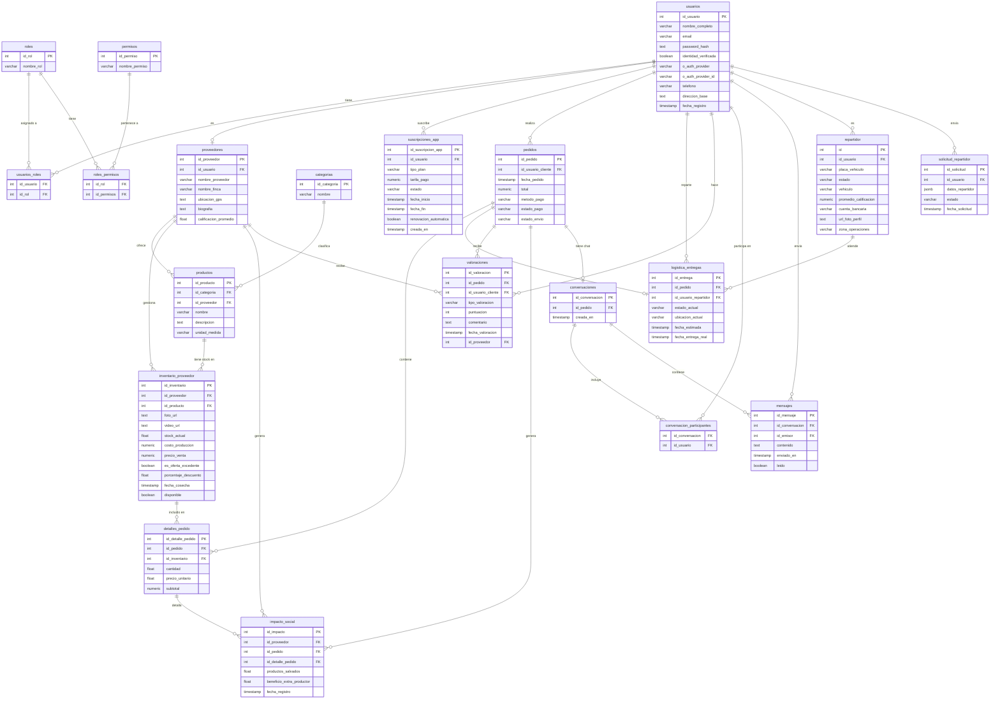

<div align="center">
  
  
  <h1 style="color: #2E7D32; font-family: 'Segoe UI', sans-serif; margin-top: 15px;">🚜 AgroTrade</h1>
  <h3 style="color: #4CAF50;"><i>Cultivando Conexiones.</i></h3>

  [](https://dotnet.microsoft.com/)
  [](https://flutter.dev)
  [](https://www.postgresql.org/)
  [](https://www.docker.com/)
</div>

---

## Tabla de Contenidos

1. [Descripción General del Proyecto](#1-descripción-general-del-proyecto)
2. [Requisitos Técnicos](#2-requisitos-técnicos)
3. [Arquitectura del Software](#3-arquitectura-del-software)
4. [Diseño del Sistema](#4-diseño-del-sistema)
5. [Base de Datos](#5-base-de-datos)
6. [Código Fuente](#6-código-fuente)
7. [Instalación y Configuración](#7-instalación-y-configuración)
8. [Manual de Despliegue](#8-manual-de-despliegue)
9. [Equipo](#9-equipo)

---

## 1. Descripción General del Proyecto

AgroTrade es una plataforma Marketplace agroalimentaria que reestructura la cadena de suministro en Nicaragua. Conecta directamente a pequeños productores con consumidores finales y negocios, eliminando intermediarios para que el agricultor reciba un precio justo y el consumidor acceda a productos frescos con origen transparente.

### Problema que resuelve

Los pequeños productores agrícolas en Nicaragua enfrentan tres problemas críticos: precios injustos impuestos por intermediarios, merma de productos por falta de canales de venta directa, y nula visibilidad ante el consumidor final. Agro ataca los tres frentes simultáneamente.

### Funcionalidades principales

**Para el Productor (Proveedor)**
- Gestión de inventario con control FIFO para productos perecederos
- Calculadora de "Precio Justo" basada en costos reales y estacionalidad
- Alertas automáticas de excedentes con descuentos para evitar merma
- Panel de impacto social: productos salvados y beneficio extra generado
- Subida de fotos y videos del producto vía Supabase Storage

**Para el Cliente**
- Búsqueda y filtrado de productos por categoría y proveedor
- Carrito multi-proveedor con pago global único
- Sistema de valoraciones por pedido
- Chat integrado por conversación de pedido
- Historial de pedidos y seguimiento de entrega

**Para el Repartidor**
- Cola de solicitudes de entrega (sistema de job queue)
- Asignación de rutas de entrega optimizadas
- Actualización de estado de entrega en tiempo real

**Administración**
- RBAC (Control de Acceso Basado en Roles) con permisos granulares
- Gestión de suscripciones de app (planes de pago para proveedores)
- Panel de impacto social agregado

---

## 2. Requisitos Técnicos

### Entorno de desarrollo

| Herramienta | Versión mínima | Enlace |
|---|---|---|
| .NET SDK | 8.0 | https://dotnet.microsoft.com/download/dotnet/8.0 |
| Flutter SDK | 3.x | https://flutter.dev/docs/get-started/install |
| PostgreSQL | 17 | https://www.postgresql.org/download/ |
| Docker | 24+ | https://docs.docker.com/get-docker/ |
| Docker Compose | 2.x | https://docs.docker.com/compose/install/ |
| Git | 2.x | https://git-scm.com/ |

### Dependencias del Backend (NuGet)

| Paquete | Versión | Propósito |
|---|---|---|
| MediatR | 14.x | Implementación CQRS / mediador |
| Microsoft.EntityFrameworkCore | 8.x | ORM principal |
| Npgsql.EntityFrameworkCore.PostgreSQL | 8.x | Driver PostgreSQL para EF Core |
| EFCore.NamingConventions | 8.x | Convención snake_case en BD |
| BCrypt.Net-Next | 4.x | Hash de contraseñas |
| Microsoft.AspNetCore.Authentication.JwtBearer | 8.x | Autenticación JWT |
| Microsoft.IdentityModel.Tokens | 8.x | Validación de tokens |
| Supabase (SDK) | 1.x | Storage de archivos multimedia |
| Google.Apis.Auth | — | Autenticación OAuth con Google |
| Swashbuckle.AspNetCore | 6.x | Documentación Swagger / OpenAPI |
| FluentValidation | — | Validación de comandos y queries |

### Requisitos de infraestructura en producción

- Servidor o instancia cloud con Docker y Docker Compose
- Base de datos PostgreSQL accesible (puede ser en la nube: Supabase DB, Render Postgres, Neon, etc.)
- Cuenta de Supabase para almacenamiento de archivos (fotos y videos de productos)
- Cuenta SMTP para envío de correos de verificación
- Credenciales de Google OAuth (Client ID y Client Secret) para login social

---

## 3. Arquitectura del Software

El backend sigue **Clean Architecture** combinada con el patrón **CQRS** (Command Query Responsibility Segregation) implementado con MediatR. Esta separación garantiza que la lógica de negocio no dependa de frameworks ni de infraestructura concreta.

### Diagrama de capas

```
┌─────────────────────────────────────────────────────────┐
│                  Agro_Trade (API)                       │
│        Controllers · Middleware · Swagger · Program     │
└────────────────────────┬────────────────────────────────┘
                         │ depende de
┌────────────────────────▼────────────────────────────────┐
│              Agro_Trade.Application                     │
│   Commands · Queries · Handlers · DTOs · Interfaces     │
└──────────┬──────────────────────────┬───────────────────┘
           │ depende de               │ es implementada por
┌──────────▼──────────┐   ┌──────────▼───────────────────┐
│  Agro_Trade.Domain  │   │  Agro_Trade.Infrastructurecc │
│  Entities · Enums   │   │  EF Core · Repos · Services  │
│  Value Objects      │   │  Supabase · SMTP · JWT · UoW │
└─────────────────────┘   └──────────────────────────────┘
```

### Capas y responsabilidades

**Domain** (`Agro_Trade.Domain`)
Núcleo del sistema. Contiene las entidades de negocio y no tiene ninguna dependencia externa. Es el corazón del modelo: `Usuario`, `Producto`, `Pedido`, `Proveedor`, `Inventario`, `Mensaje`, etc.

**Application** (`Agro_Trade.Application`)
Orquesta los casos de uso mediante el patrón CQRS. Cada funcionalidad tiene su `Command` o `Query` y su `Handler` correspondiente. Define interfaces (`IUnitofWork`, `ITokenServices`, `IEmailService`, `IStorageService`) que son implementadas en Infrastructure, nunca al revés.

**Infrastructure** (`Agro_Trade.Infrastructure`)
Implementaciones concretas: EF Core + PostgreSQL (con naming convention snake_case), repositorio genérico, Unit of Work, generación de tokens JWT, envío de emails SMTP, almacenamiento en Supabase Storage, y repositorio en memoria para códigos de verificación.

**API** (`Agro_Trade`)
Capa de entrada. Controladores REST, middleware de manejo de excepciones (`ExceptionHandlingMiddleware`), configuración de JWT Bearer, CORS, Swagger con soporte Bearer, y auto-aplicación de migraciones de EF Core al arrancar.

### Patrón CQRS con MediatR

```
HTTP Request
    │
    ▼
Controller
    │  envía Command / Query
    ▼
MediatR (IMediator.Send)
    │  resuelve el Handler
    ▼
Handler (IRequestHandler<TRequest, TResponse>)
    │  usa IUnitOfWork / IRepository
    ▼
Repository / DbContext (EF Core)
    │
    ▼
PostgreSQL
```

### Autenticación y autorización

- **JWT Bearer**: tokens firmados con HMAC-SHA256, expiración de 24 horas, contienen claims de `NameIdentifier`, `Email`, `Name` y `Role`
- **RBAC**: la entidad `Rol` se asocia a `Permiso` a través de `RolPermiso`; el usuario tiene roles vía `UsuarioRol`
- **OAuth Google**: flujo de autenticación con `Google.Apis.Auth` para login social
- **Verificación por email**: código temporal almacenado en memoria (`InMemoryVerificationCodeRepository`) con expiración

---

## 4. Diseño del Sistema

### Módulos funcionales

El sistema se divide en los siguientes módulos, cada uno con sus propios Commands/Queries y Controller:

| Módulo | Controller | Funcionalidad |
|---|---|---|
| Auth | `AuthController` | Login, registro, Google OAuth, verificación de email |
| Usuarios | `UsersController` | CRUD de usuarios, perfil |
| Proveedores | `ProveedoresController` | Registro y gestión de productores |
| Categorías | `CategoriasController` | Categorías de productos |
| Productos | `ProductosController` | Catálogo de productos |
| Inventario | `InventariosController` | Stock, precios, fotos, ofertas de excedente |
| Pedidos | — | Creación y gestión de pedidos multi-proveedor |
| Entregas | `DeliveryJobRequestController` | Cola y asignación de repartidores |
| Valoraciones | `ValoracionesController` | Calificaciones de pedidos |
| Impacto Social | `ImpactosSocialesController` | Registro de productos salvados y beneficio extra |
| Conversaciones | `ConversacionesController` | Chat interno por pedido |
| Suscripciones | `SuscripcionesController` | Planes y pagos de suscripción |

### Flujo principal: ciclo de vida de un pedido

```
Cliente busca productos
        │
        ▼
Agrega al carrito (multi-proveedor)
        │
        ▼
Confirma pedido → Pedido creado (estado: Pendiente)
        │
        ▼
Sistema asigna entrega → Cola de repartidores
        │
        ▼
Repartidor acepta → LogisticaEntrega creada
        │
        ▼
Entrega confirmada → ImpactoSocial registrado
        │
        ▼
Cliente valora → Valoracion guardada
        │
        ▼
Proveedor recibe calificación actualizada
```

### Flujo de autenticación

```
POST /api/auth/login
│  → Busca usuario por email
│  → Verifica BCrypt hash
│  → Genera JWT con roles
│  → Retorna token + nombre
```

```
POST /api/auth/google
│  → Verifica GoogleIdToken con Google.Apis.Auth
│  → Busca o crea usuario (OAuth)
│  → Genera JWT interno
```

---

## 5. Base de Datos

**Motor:** PostgreSQL 17
**ORM:** Entity Framework Core 8 con Npgsql y snake_case naming convention
**Migraciones:** EF Core Migrations (se aplican automáticamente al iniciar el contenedor)

Las migraciones aplicadas hasta la fecha son:
1. `MigracionInicial` — tablas base del dominio
2. `ExecJafet` — ajustes de entidades secundarias
3. `Cola_Solicitudes` — tabla de solicitudes de repartidor
4. `ImpactoSocial` — tabla de impacto social
5. `UpdateValoraciones` — ajuste en valoraciones

### Diagrama Entidad-Relación



### Descripción de tablas principales

| Tabla | Descripción |
|---|---|
| `usuarios` | Todos los actores del sistema: clientes, proveedores, repartidores y admins |
| `roles` / `permisos` | Control de acceso basado en roles (RBAC) |
| `proveedores` | Perfil extendido de agricultor/productor, vinculado a un usuario |
| `productos` | Catálogo de productos agrícolas por proveedor y categoría |
| `inventario_proveedor` | Stock, precio, multimedia y ofertas de excedente por producto |
| `pedidos` | Cabecera del pedido con estado de pago y envío |
| `detalles_pedido` | Líneas de pedido (item + cantidad + precio unitario) |
| `logistica_entregas` | Estado, ubicación y seguimiento de la entrega por pedido |
| `repartidor` | Datos operativos y perfil del repartidor asignado a entregas |
| `solicitud_repartidor` | Solicitudes de ingreso al programa de repartidores con datos estructurados |
| `valoraciones` | Puntuación y comentario del cliente tras recibir el pedido |
| `impacto_social` | Métricas de productos salvados y beneficio extra al productor |
| `conversaciones` / `mensajes` | Chat interno asociado a cada pedido |
| `suscripciones_app` | Planes de pago para proveedores |

---

## 6. Código Fuente

### Estructura del repositorio (monorepo)

```
Agro_Trade/
├── README.md
├── .env                          # Variables de entorno (no subir a producción)
├── docker-compose.yml            # Orquestación de contenedores
├── .gitignore
│
├── Backend/
│   ├── Dockerfile                # Build multi-etapa SDK → Runtime
│   ├── Agro_Trade.sln          # Solución .NET
│   └── src/
│       ├── Agro_Trade.Domain/                # Capa de Dominio
│       │   ├── Entities/                     # Entidades de negocio (21 entidades)
│       │   ├── Events/                       # DTOs de dominio
│       │   └── Common/                       # Interfaces base (IEntity, etc.)
│       │
│       ├── Agro_Trade.Application/           # Capa de Aplicación (CQRS)
│       │   ├── Common/
│       │   │   ├── DTOs/                     # Data Transfer Objects
│       │   │   ├── Interface/                # Contratos (IUnitOfWork, IRepository, etc.)
│       │   │   └── Result.cs                 # Wrapper genérico de respuesta
│       │   ├── DependencyInjection/          # Extensión AddApplicationServices()
│       │   └── Features/                     # Casos de uso organizados por módulo
│       │       ├── Auth/                     # Login, GoogleSignIn, VerifyCode
│       │       ├── Categorias/
│       │       ├── ColasRoles/               # Queue de solicitudes de repartidor
│       │       ├── Conversaciones/
│       │       ├── ImpactoSocial/
│       │       ├── Inventarios/
│       │       ├── Productos/
│       │       ├── Proveedores/
│       │       ├── Suscripciones/
│       │       ├── Usuarios/
│       │       └── Valoraciones/
│       │
│       ├── Agro_Trade.Infrastructure/        # Capa de Infraestructura
│       │   ├── DependencyInjection/          # Extensión AddInfrastructureServices()
│       │   ├── Persistence/
│       │   │   ├── AgroTradeDbContext.cs   # DbContext con 21 DbSets
│       │   │   ├── UnitofWork/               # Implementación Unit of Work
│       │   │   └── Migrations/               # 5 migraciones EF Core
│       │   ├── Repository/                   # Repositorio genérico + especializados
│       │   └── Services/
│       │       ├── TokenServices.cs          # Generación JWT con roles
│       │       ├── SmtpEmailService.cs       # Envío de emails SMTP
│       │       ├── SupabaseStorageService.cs # Upload a Supabase Storage
│       │       └── InMemoryVerificationCodeRepository.cs
│       │
│       ├── Agro_Trade/                       # Capa de API (Punto de entrada)
│       │   ├── Program.cs                    # Bootstrap de la aplicación
│       │   ├── appsettings.json              # Configuración por ambiente
│       │   ├── Controllers/                  # 11 controladores REST
│       │   ├── Middlewares/                  # ExceptionHandlingMiddleware
│       │   └── agro_backend.sql            # DDL completo de referencia
│       │
│       └── agro_backend.sql                # Script SQL de la base de datos
│
└── Frontend/
    └── (Flutter — en desarrollo)
```

### Convenciones de código

- **Nombres de entidades:** PascalCase en C#, snake_case en base de datos (via `UseSnakeCaseNamingConvention()`)
- **Handlers CQRS:** cada Feature tiene un archivo con el `Command`/`Query` record y el `Handler` en el mismo archivo
- **Respuestas de API:** wrapper genérico `Result<T>` con código HTTP, datos, mensaje y flag de éxito
- **Inyección de dependencias:** todo se registra mediante métodos de extensión (`AddApplicationServices()`, `AddInfrastructureServices()`)
- **Repositorios:** patrón genérico `IRepository<T>` + Unit of Work; repositorios especializados heredan del genérico

---

## 7. Instalación y Configuración

### Prerrequisitos

Tener instalados: .NET 8 SDK, Docker, Docker Compose y Git.

### 1. Clonar el repositorio

```bash
git clone https://github.com/isaacJ212/AgroTrade.git
cd Agro_Trade
```

### 2. Configurar variables de entorno

Copia el archivo `.env` de ejemplo y rellena los valores:

```bash
cp .env .env.local
```

Variables requeridas en `.env`:

```env
# Base de datos PostgreSQL
DB_HOST=tu_host_postgres
DB_PORT=5432
DB_NAME=Agro_Trade
DB_USER=tu_usuario
DB_PASS=tu_contraseña_segura
```

Variables en `Backend/src/Agro_Trade/appsettings.json`:

```json
{
  "ConnectionStrings": {
    "AgroTradeDatabase": "Host=...;Port=5432;Database=Agro_Trade;Username=...;Password=..."
  },
  "Jwt": {
    "Issuer": "AgroTradeApi",
    "Audience": "AgroTradeApp",
    "Key": "clave-secreta-minimo-32-caracteres"
  },
  "Supabase": {
    "Url": "https://tu-proyecto.supabase.co",
    "ServiceRoleKey": "tu-service-role-key"
  },
  "Google": {
    "ClientId": "tu-google-client-id.apps.googleusercontent.com"
  },
  "Smtp": {
    "Host": "smtp.tu-proveedor.com",
    "Port": 587,
    "Username": "no-reply@tu-dominio.com",
    "Password": "tu-contraseña-smtp"
  }
}
```

> **Seguridad:** Nunca subas valores reales de `.env` ni `appsettings.json` al repositorio. Ambos archivos están en `.gitignore`.

### 3. Levantar con Docker Compose (recomendado)

```bash
docker compose up --build
```

La API arrancará en `http://localhost:5000`. Las migraciones de EF Core se aplican automáticamente al iniciar el contenedor.

### 4. Levantar en desarrollo local (sin Docker)

**Backend:**

```bash
cd Backend/src/Agro_Trade

# Restaurar paquetes
dotnet restore

# Aplicar migraciones manualmente
dotnet ef database update --project ../Agro_Trade.Infrastructure

# Ejecutar el servidor
dotnet run
```

La API estará disponible en `https://localhost:5001`.  
Swagger UI: `https://localhost:5001/swagger`

**Frontend Flutter:**
La API estará disponible en `https://localhost:5001`.  
Swagger UI: `https://localhost:5001/swagger`

**Frontend Flutter:**

```bash
cd Frontend
flutter pub get
flutter run
```

> Configura la URL base del backend en el archivo de entorno de Flutter antes de ejecutar.

---

## 8. Manual de Despliegue

### Despliegue con Docker (producción)

El proyecto incluye un `Dockerfile` multi-etapa optimizado para producción:

```
Etapa 1 (build)  → SDK .NET 8  → compila y publica en Release
Etapa 2 (final)  → Runtime ASP.NET 8 → imagen final ~200MB
```

**Pasos para desplegar en un servidor con Docker:**

```bash
# 1. Clonar el repositorio en el servidor
git clone https://github.com/isaacJ212/AgroTrade.git
cd Agro_Trade

# 2. Configurar las variables de entorno reales
nano .env

# 3. Construir y levantar
docker compose up -d --build

# 4. Verificar que el contenedor está corriendo
docker ps
docker logs Agro_Trade_api
```

### Variables de entorno en producción (docker-compose.yml)

El `docker-compose.yml` lee las variables del archivo `.env` y las pasa al contenedor:

```yaml
environment:
  - ASPNETCORE_ENVIRONMENT=Production
  - ConnectionStrings__AgroTradeDatabase=Host=${DB_HOST};Port=${DB_PORT};Database=${DB_NAME};Username=${DB_USER};Password=${DB_PASS}
  - Jwt__Issuer=AgroTradeApi
  - Jwt__Audience=AgroTradeApp
  - Jwt__Key=${JWT_KEY}
```

### Despliegue en Render.com

1. Crear un nuevo **Web Service** apuntando al repositorio de GitHub
2. Seleccionar **Docker** como entorno de build
3. Configurar las variables de entorno desde el panel de Render (equivalentes a las del `.env`)
4. Render detectará el `Dockerfile` automáticamente y construirá la imagen
5. El `EXPOSE 8080` del Dockerfile coincide con el puerto que Render espera

### Verificación post-despliegue

| Endpoint | Descripción |
|---|---|
| `GET /swagger` | Swagger UI — verifica que la API respondió |
| `POST /api/auth/login` | Prueba el flujo de autenticación |
| `GET /api/productos` | Verifica conexión a la base de datos |

### Actualización de la aplicación

```bash
# En el servidor
git pull origin main
docker compose up -d --build
```

Las migraciones nuevas se aplican automáticamente al arrancar el contenedor gracias a:

```csharp
// Program.cs
dbContext.Database.Migrate();
```

---

## 9. Equipo

| Nombre | Rol |
|---|---|
| Isaac Acuña | Desarrollador Backend |
| Jafet | Desarrollador Backend |
| Anielka Sequeira| Marketing |
| Sandy Salinas| Comunicación |
| Fabian Arteaga | Diseño UI/UX |

---

<div align="center">
  <strong>AgroTrade</strong> — Hackathon Nicaragua 2026 · UNAN-Managua
</div>
