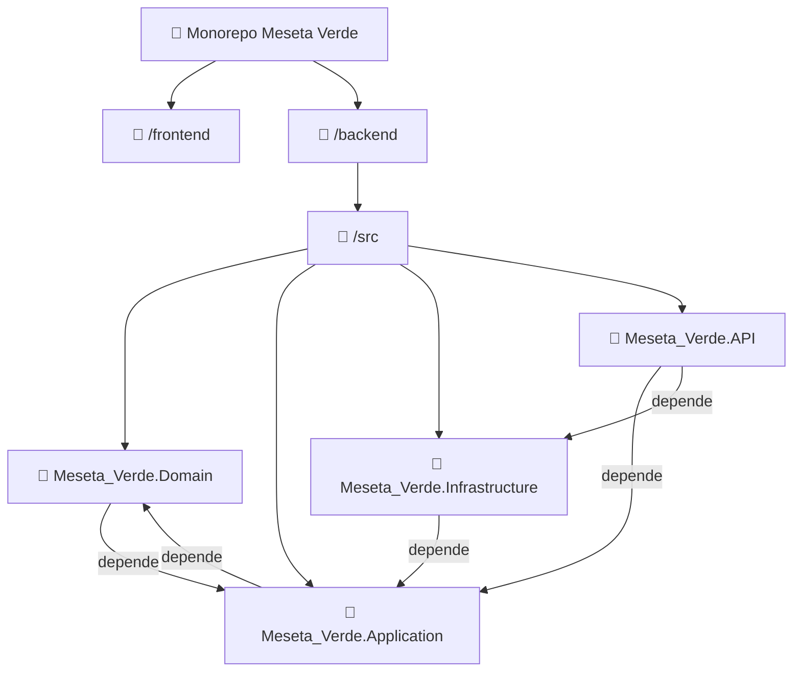

<div align="center">
  <h1 style="color: #2E7D32; font-family: 'Segoe UI', sans-serif;">🚜 Meseta Verde</h1>
  <h3 style="color: #4CAF50;"><i>El campo a un clic de distancia.</i></h3>
  <hr style="width: 60%; border: 1px solid #4CAF50;">
</div>

---

## 🚀 Descripción Breve
<p align="justify" style="font-size: 1.05rem; line-height: 1.6;">
  Meseta Verde es una plataforma Marketplace integral que reestructura la cadena de suministro agroalimentario en Nicaragua. Conectamos directamente a pequeños productores con consumidores finales y negocios a través de una arquitectura robusta basada en geolocalización y trazabilidad total. Nuestra solución elimina la ineficiencia de los intermediarios, permitiendo que el agricultor reciba un precio justo, mientras el consumidor accede a productos frescos y de origen transparente.
</p>

---

## 🔑 Funcionalidades Clave

<div style="display: flex; gap: 20px; flex-wrap: wrap; justify-content: center;">
  <div style="flex: 1; min-width: 250px; border: 1px solid #ddd; padding: 15px; border-radius: 12px; background: #f9fbe7; box-shadow: 0 4px 8px rgba(0,0,0,0.05);">
    <h3 style="color: #33691E;">🧑‍🌾 Para el Productor</h3>
    <ul style="list-style-type: '✅ '; padding-left: 20px;">
      <li><b>Gestión de Inventario:</b> Control FIFO para priorizar la salida de productos perecederos[cite: 1].</li>
      <li><b>Calculadora de "Precio Justo":</b> Algoritmo basado en costos reales y estacionalidad[cite: 1].</li>
      <li><b>Alertas de Excedentes:</b> Descuentos automáticos para evitar mermas[cite: 1].</li>
    </ul>
  </div>
  <div style="flex: 1; min-width: 250px; border: 1px solid #ddd; padding: 15px; border-radius: 12px; background: #e8f5e9; box-shadow: 0 4px 8px rgba(0,0,0,0.05);">
    <h3 style="color: #1B5E20;">🛒 Para el Cliente</h3>
    <ul style="list-style-type: '🛒 '; padding-left: 20px;">
      <li><b>Geofencing:</b> Prioriza productores cercanos para maximizar la frescura[cite: 1].</li>
      <li><b>Carrito Multi-Proveedor:</b> Pago global único con división automática de pedidos[cite: 1].</li>
      <li><b>Pagos Seguros:</b> Sistema de retención (Escrow) para garantizar la calidad[cite: 1].</li>
    </ul>
  </div>
</div>

---

## 🛠️ Stack Tecnológico
<table width="100%" style="border-collapse: collapse; font-size: 1rem; box-shadow: 0 2px 5px rgba(0,0,0,0.1);">
  <thead>
    <tr style="background-color: #2E7D32; color: white;">
      <th style="padding: 10px; border-radius: 8px 0 0 0;">Capa</th>
      <th style="padding: 10px; border-radius: 0 8px 0 0;">Tecnología</th>
    </tr>
  </thead>
  <tbody>
    <tr style="background-color: #f1f8e9;">
      <td style="padding: 8px; border-bottom: 1px solid #ddd;"><b>Frontend</b></td>
      <td style="padding: 8px; border-bottom: 1px solid #ddd;">Flutter (Multiplataforma)</td>
    </tr>
    <tr style="background-color: #ffffff;">
      <td style="padding: 8px; border-bottom: 1px solid #ddd;"><b>Backend</b></td>
      <td style="padding: 8px; border-bottom: 1px solid #ddd;">.NET 8 (C#) con Clean Architecture y CQRS</td>
    </tr>
    <tr style="background-color: #f1f8e9;">
      <td style="padding: 8px; border-bottom: 1px solid #ddd;"><b>Base de Datos</b></td>
      <td style="padding: 8px; border-bottom: 1px solid #ddd;">PostgreSQL con NetTopologySuite</td>
    </tr>
  </tbody>
</table>

---

## 🏗️ Arquitectura

<details>
  <summary style="font-size: 1.2rem; font-weight: bold; color: #2E7D32;"><b>Ver diagrama y estructura del proyecto</b></summary>

### Diagrama de capas (Clean Architecture + CQRS)



### Estructura del proyecto (monorepo)

- **`/frontend`**  
  Código fuente de la aplicación móvil desarrollada con Flutter.

- **`/backend`**  
  Backend basado en .NET 8, organizado en capas siguiendo Clean Architecture:

  - **`/backend/src/Meseta_Verde.Domain`**  
    Núcleo del sistema: entidades, value objects, interfaces de repositorios (sin dependencias externas).

  - **`/backend/src/Meseta_Verde.Application`**  
    Casos de uso (CQRS), DTOs, interfaces de servicios y comportamientos comunes (validaciones, logs, etc.).

  - **`/backend/src/Meseta_Verde.Infrastructure`**  
    Implementaciones concretas de persistencia (Entity Framework Core con PostgreSQL), servicios externos (geolocalización, notificaciones, etc.) y configuraciones.

  - **`/backend/src/Meseta_Verde.API`**  
    Capa de presentación: controladores REST, middleware, configuración de Swagger/OpenAPI y punto de entrada de la aplicación.

</details>

---

## 🚀 Guía de inicio rápido

Sigue estos pasos para levantar el entorno de desarrollo en tu máquina local.

### Requisitos previos

- [.NET 8 SDK](https://dotnet.microsoft.com/download/dotnet/8.0)
- [Flutter](https://flutter.dev/docs/get-started/install) (con el emulador o dispositivo configurado)
- [PostgreSQL](https://www.postgresql.org/download/) (o usar Docker)
- [Git](https://git-scm.com/)

### 1. Clonar el repositorio

```bash
git clone https://github.com/isaacJ212/Meseta-Verde.git
cd meseta-verde
```

### 2. Backend (.NET 8)

```bash
cd backend
cd src   
```

- **Configurar la cadena de conexión**  
  Abre el archivo `appsettings.json` (ubicado en `/backend` o en `src/Meseta_Verde.API`) y modifica la sección `ConnectionStrings:DefaultConnection` con los datos de tu PostgreSQL.

- **Aplicar migraciones y crear la base de datos**

```bash
dotnet ef database update
```

- **Ejecutar el servidor**

```bash
dotnet run --project src/Meseta_Verde
```

La API estará disponible en `https://localhost:5001` (o el puerto configurado).  
Puedes acceder a la documentación Swagger en `https://localhost:5001/swagger`.

### 3. Frontend (Flutter)

Abre otra terminal y navega a la carpeta del frontend:

```bash
cd frontend
```

- **Instalar dependencias**

```bash
flutter pub get
```

- **Ejecutar la aplicación**

```bash
flutter run
```

> **Nota:** Asegúrate de tener un emulador Android/iOS o un dispositivo físico conectado.  
> Si deseas apuntar a un backend en otra URL, modifica la variable de entorno correspondiente en el archivo de configuración de Flutter.

---

## 👥 Equipo Meseta Verde

<div style="display: flex; flex-wrap: wrap; gap: 25px; justify-content: center; margin: 20px 0;">

  <!-- Isaac Acuña -->
  <div style="background: linear-gradient(145deg, #f0f7f0, #ffffff); border-radius: 20px; padding: 20px; width: 200px; text-align: center; box-shadow: 0 8px 16px rgba(0,0,0,0.1); border: 1px solid #c8e6c9;">
    
    <h4 style="color: #1B5E20; margin: 10px 0 5px;">Isaac Acuña</h4>
    <p style="color: #555; font-size: 0.9rem;">Desarrollador</p>
  </div>

  <!-- Jafet -->
  <div style="background: linear-gradient(145deg, #f0f7f0, #ffffff); border-radius: 20px; padding: 20px; width: 200px; text-align: center; box-shadow: 0 8px 16px rgba(0,0,0,0.1); border: 1px solid #c8e6c9;">
    
    <h4 style="color: #1B5E20; margin: 10px 0 5px;">Jafet</h4>
    <p style="color: #555; font-size: 0.9rem;">Desarrollador</p>
  </div>

  <!-- Fabian Arteaga -->
  <div style="background: linear-gradient(145deg, #f0f7f0, #ffffff); border-radius: 20px; padding: 20px; width: 200px; text-align: center; box-shadow: 0 8px 16px rgba(0,0,0,0.1); border: 1px solid #c8e6c9;">
    
    <h4 style="color: #1B5E20; margin: 10px 0 5px;">Fabian Arteaga</h4>
    <p style="color: #555; font-size: 0.9rem;">Marketing</p>
  </div>

  <!-- Emeeli Yassiles -->
  <div style="background: linear-gradient(145deg, #f0f7f0, #ffffff); border-radius: 20px; padding: 20px; width: 200px; text-align: center; box-shadow: 0 8px 16px rgba(0,0,0,0.1); border: 1px solid #c8e6c9;">
    
    <h4 style="color: #1B5E20; margin: 10px 0 5px;">Emeli Yassiles</h4>
    <p style="color: #555; font-size: 0.9rem;">Comunicador</p>
  </div>

  <!-- Angie -->
  <div style="background: linear-gradient(145deg, #f0f7f0, #ffffff); border-radius: 20px; padding: 20px; width: 200px; text-align: center; box-shadow: 0 8px 16px rgba(0,0,0,0.1); border: 1px solid #c8e6c9;">
    
    <h4 style="color: #1B5E20; margin: 10px 0 5px;">Angie</h4>
    <p style="color: #555; font-size: 0.9rem;">Diseñador</p>
  </div>

</div>

<p align="center" style="font-size: 1.1rem; background: #e8f5e9; padding: 12px; border-radius: 30px; display: inline-block;">
  <strong>Proyecto:</strong> Meseta Verde – Hackathon Nicaragua 2026
</p>


